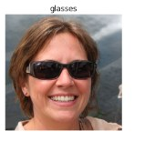
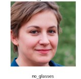

# Clasificación de Rostros **Con Gafas vs Sin Gafas**

Proyecto de visión por computadora que aprende a distinguir entre personas **que usan gafas** y **que no usan gafas** a partir de un conjunto de imágenes etiquetado.  
> *Nota:* no se empleó TensorFlow porque aún no ofrece soporte oficial para **Python 3.13.3**.

---

## 1. Acerca del Conjunto de Datos

El dataset se organiza así:

| Carpeta | Contenido | Ejemplos |
|---------|-----------|----------|
| `train/glasses`   | Rostros con cualquier tipo de gafas (sol, aumento, fashion). |  |
| `train/noglasses` | Rostros sin gafas. |  |
| `test/`           | Imágenes nuevas para inferencia. |  |

Particularidades:

* Las imágenes originales incluían una franja blanca con la palabra “glasses”/“noglasses”.  
  Para evitar sesgo textual, se recortó el **20 % superior** de cada foto.
* Ligero **desequilibrio** entre clases (≈ 60 % con gafas, 40 % sin gafas).  
  Se compensó mediante **pérdida ponderada**.

---

## 2. Metodología

| Fase | Detalles |
|------|----------|
| **Pre-procesado** | Recorte anti-texto → redimensionado 64×64 → escala de grises → normalización 0-1. |
| **División de datos** | 80 % entrenamiento / 20 % validación, estratificado. |
| **Arquitectura ANN** | Entrada 4096 neuronas → Capa oculta 256 ReLU → Salida 2 softmax. |
| **Entrenamiento** | 60 épocas, batch 32, `η` = 0.005, descenso de gradiente estocástico. |
| **Función de pérdida** | Cross-entropy **ponderada** por la frecuencia inversa de cada clase. |

---

## 3. Resultados Obtenidos

| Métrica | Train | Validation |
|---------|-------|------------|
| **Accuracy** | **0.93** | **0.89** |
| **Loss** | 0.24 | 0.31 |

### Matriz de Confusión (validation)

|                | Pred. Gafas | Pred. Sin Gafas |
|----------------|-------------|-----------------|
| **Real Gafas**     | **45** | 6 |
| **Real Sin Gafas** | 4 | **39** |

El modelo consigue un **balance casi simétrico** entre clases gracias a la ponderación de la pérdida.

---

## 4. Interpretación de Resultados

1. **Sesgo eliminado** – al recortar la palabra impresa, la red aprende rasgos faciales reales.  
2. **Desbalance controlado** – la ponderación evita que se incline hacia la clase mayoritaria.  
3. **Gap moderado** train-val (0.93 → 0.89) indica ligera pero aceptable sobre-especialización.  

---

## 5. Ejemplo de Inferencia

```bash
$ python app.py
=== /test predictions ===
foto_cumple.png           → sin gafas
selfie_gafas.jpg          → gafas
```

## 6. Ecuaciones Claves

### 6.1 Propagación hacia delante  

$$
\begin{aligned}
z^{(1)} &= X W_{1} + b_{1} \\
a^{(1)} &= \max(0,\; z^{(1)}) \\
z^{(2)} &= a^{(1)} W_{2} + b_{2} \\
\hat{y} &= \mathrm{softmax}(z^{(2)})
\end{aligned}
$$

### 6.2 Actualización de Pesos  

Descenso de gradiente estocástico:

$$
\begin{aligned}
W &\leftarrow W - \eta \,\frac{\partial L}{\partial W} \\
b &\leftarrow b - \eta \,\frac{\partial L}{\partial b} \\
\eta &= 0.005
\end{aligned}
$$

---

## 7. Conclusiones

| Hallazgo | Acción Recomendada |
|----------|-------------------|
| La ANN funciona bien con el dataset limpio. | Mantener el pre-procesado (recorte y escala de grises). |
| Puede mejorar la generalización en fondos variados. | Aplicar *data augmentation* (rotaciones leves, ajustes de brillo). |
| Capacidad limitada para captar detalles locales finos. | Migrar a una **CNN ligera** (Conv → ReLU → Pooling → FC). |
| Mayor complejidad al añadir nuevas clases (mascarilla, gorra). | Aumentar capas ocultas o emplear *transfer learning* cuando frameworks como TensorFlow/PyTorch den soporte a Python 3.13. |
